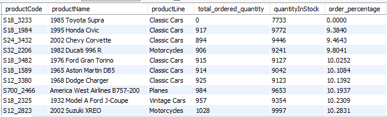
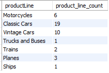

# Coursera Analyze Data in a Model Car Database

Problem Scenario: Mint Classics Company, a retailer of classic model cars and other vehicles, is looking at closing one of their storage facilities. 

To support a data-based business decision, they are looking for suggestions and recommendations for reorganizing or reducing inventory, while still maintaining timely service to their customers. For example, they would like to be able to ship a product to a customer within 24 hours of the order being placed.

Some Questions To Consider:
1) Where are items stored and if they were rearranged, could a warehouse be eliminated?

2) How are inventory numbers related to sales figures? Do the inventory counts seem appropriate for each item?

3) Are we storing items that are not moving? Are any items candidates for being dropped from the product line?

# 1. DATA INFORMATION

The data was obtained through Coursera, the provider of the project. The Enhanced Entity Relationship (EER) diagram below shows the tables in the data and how they are related. The analysis was done in MySQL workbench.

# 2. ANALYSIS

### 2.1 PRE-ANALYSIS 
The tables that were used in the analysis were:
* warehouses
* products
* productlines
* orders
* orderdetails

Before getting into the analysis I had to look into some of the column names and get more clarity on what they meant:
* warehouses-warehousePctCap: Assumed to mean "warehouse percentage capacity" and means how much space has been used up in the warehouse
* products-MSRP: is the manufacturer's suggested retail price (assumed to be in thousands of dollars)
* products-buyPrice: assumed to be how much the company bough the product for

### 2.2 ANALYSIS 

The first thing i did was to get a basic of the data:
* number of warehouses = 4
* number of distinct products = 110
* number of product lines = 7
* number of orders = 326

The EER diagram shows that each type of product will not be at multiple warehouses, thus at I looked at the warehouse distribution of products :

| Warehouse Name | Capacity Percentage | Product Lines | Total Stock Quantity | 
|----------------|-------------|----------------|---------------------|
| North          |  72 | Motorcycles, Planes | 131 688        |
| East           |  67 |Classic Cars  | 219 183              |
| West           |  50 |Vintage Cars  | 124 880              |
| South          |  75 |Trucks, Buses, Ships, Trains | 79 380|

Looking at the table, I thought it might be a good idea to look into combining the inventories of the east and west warehouse since they house similar products. Warehouse North has planes and those could be very difficult to squeeze in the other warehouses due to their sizes which apparent to capacity percentage of - warehouse North has the almost the same stock quantity as warehouse West but a very much higher capacity percentage. This logic of low inventory but high capacity percentage also applies to warehouse South, futher hinting that the East and West should be combined.

I then decided to look at products that are overstocked, where in this case I define overstocked as where the total quantity of ordered prodcut over the years is less than 15% of the total quantity that is stocked.   

So clearly there is some room to remove some products and optimise inventory housing, more so, its clearly that optimisation can be done by removing some cars which are not selling. 

Using the percentage capacity and total inventory size
I calculated the aproximate total warehouse capacity

| warehouse | capacity percentage | total inventory | full warehouse capacity |
|-----------|---------------------|-----------------|-------------------------|
| East      |	67	              | 219183          | 327139                  |
| West      |	50                | 124880          | 249760                  |

Looking at the table it would make sense to relocate the cars from the West warehouse to the East warehouse since it has a higher max capacity.

I then decided to look at how much total profit each car has brought in by only considering the orders that have been marked as "shipped". The results can be found in the csv file "car_total_profits".

# SUGGESTIONS
* Relocate the cars from the west warehouse to the east warehouse
* use the file "car_total_profits" to decide on which cars to keep

# NOTES
* Product and warehouse physical sizes data was not provided. This makes it hard to know much space single a product takes up in a single warehouse
* Warehouse rental cost. How much does it cost to rent a single warehouse. It was assumed all warehouses cost the same regardless of what they house
* Analysis for which specifc cars to keep will be provided
